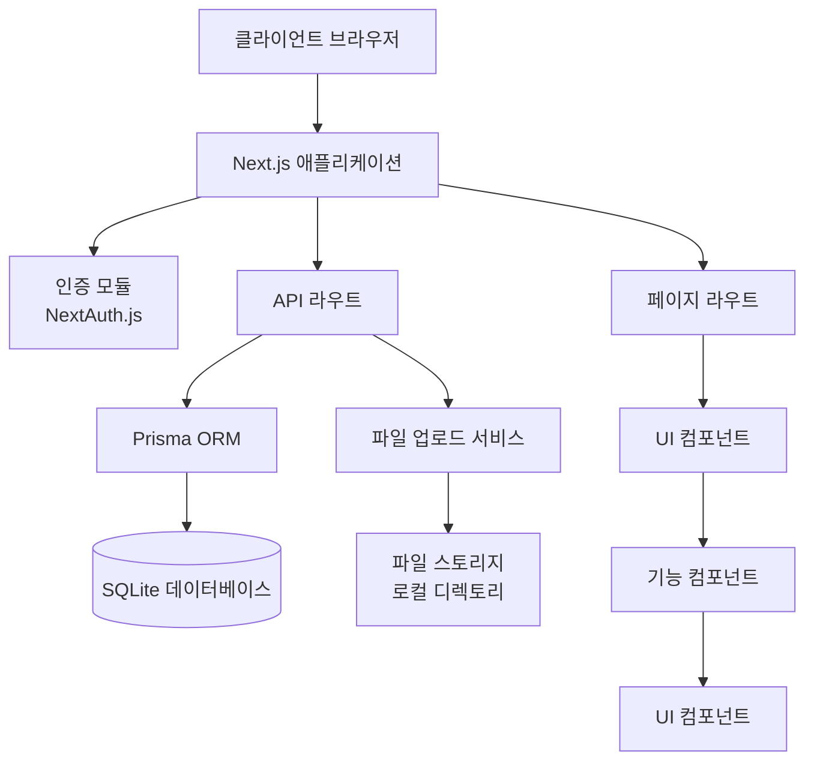
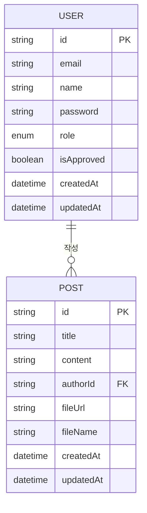
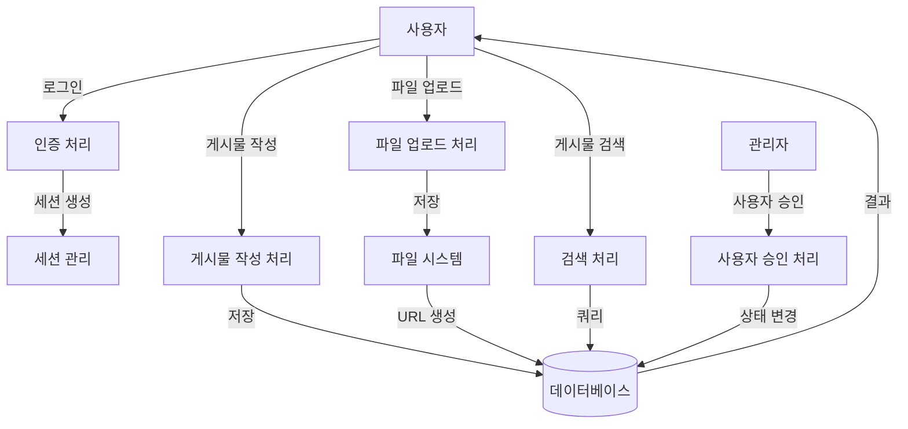
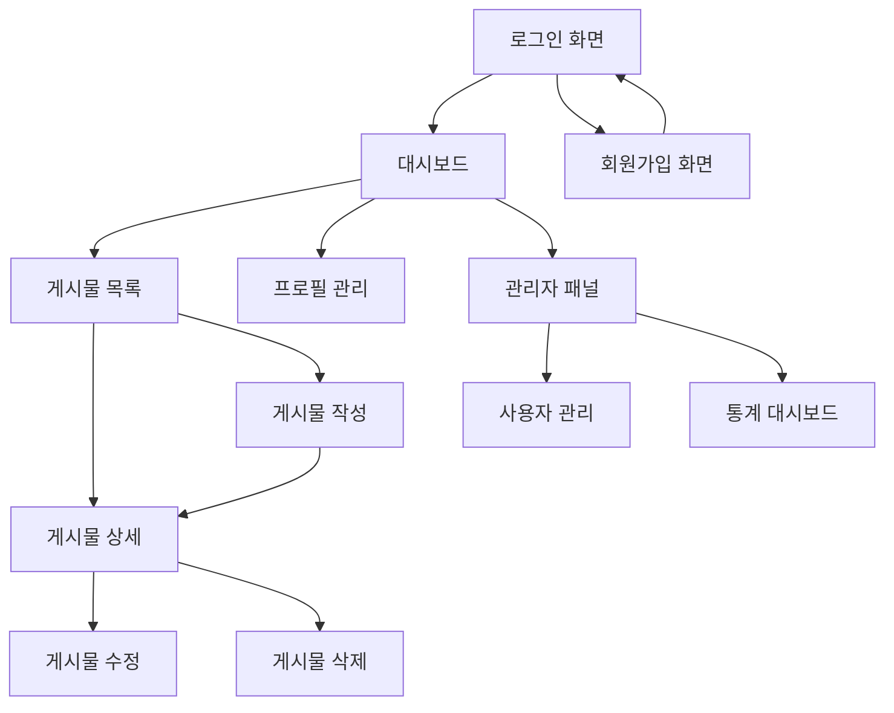

# ATArchive 시스템 설계서

# ATArchive 프로젝트 완료 보고서

## 1. 프로젝트 개요

### 1.1 문서 목적

ATArchive 시스템의 전반적인 아키텍처와 구성 요소를 정의하고, 시스템 설계 방향성을 제시

### 1.2 프로젝트명

- **ATArchive 주식정보 아카이브 시스템**
  - ATArchive Overseas (해외주식정보 아카이브 시스템)
  - ATArchive Domestic (국내주식정보 아카이브 시스템)

### 1.3 주요 기능

- 사용자 인증 및 권한 관리 (회원가입, 로그인, 관리자 승인)
- 게시물 등록 및 관리 (제목, 내용, 첨부파일)
- 엑셀 파일 미리보기 및 분석 기능
- 고급 검색 기능 (날짜, 키워드, 작성자 등)
- 관리자 대시보드 및 사용자 관리

## 2. 요구사항 분석

### 2.1 기능 요구사항

1. **사용자 관리**

   - 회원가입 및 로그인
   - 사용자 프로필 관리
   - 관리자 승인 시스템
   - 사용자 권한 관리 (일반/관리자)
2. **게시물 관리**

   - 게시물 작성, 수정, 삭제
   - 첨부파일 업로드 및 다운로드
   - 엑셀 파일 미리보기
   - 게시물 목록 페이징 및 정렬
3. **검색 및 필터링**

   - 제목, 내용, 작성자 기반 검색
   - 날짜 범위 검색
   - 고급 필터링 옵션
4. **관리자 기능**

   - 사용자 계정 관리 및 승인
   - 시스템 통계 확인
   - 일괄 사용자 처리 (벌크 승인/거부)

### 2.2 비기능 요구사항

1. **성능**

   - 페이지 로드 시간 < 2초
   - 최대 500명 동시 접속 처리
2. **안정성**

   - 99.9% 가용성
   - 안정적인 파일 업로드/다운로드
3. **보안**

   - 사용자 인증 및 권한 검증
   - 관리자 승인 기반 접근 제어
   - 비밀번호 암호화 저장
4. **확장성**

   - 모듈화된 구조로 기능 확장 용이
   - API 기반 설계로 외부 시스템 연동 가능

## 3. 아키텍처 설계

### 3.1 전체 시스템 아키텍처 다이어그램

### 3.2 주요 모듈 구성 및 상호작용 방식

| 모듈               | 설명                              | 주요 기능                                  |
| ------------------ | --------------------------------- | ------------------------------------------ |
| 인증 모듈          | NextAuth.js 기반 사용자 인증 처리 | 로그인, JWT 관리, 세션 처리                |
| API 라우트         | RESTful API 엔드포인트 제공       | CRUD 작업, 파일 처리                       |
| Prisma ORM         | 데이터베이스 접근 계층            | 쿼리 최적화, 스키마 관리                   |
| 파일 업로드 서비스 | 파일 처리 및 저장 관리            | 파일 업로드, 유효성 검사                   |
| UI 컴포넌트        | 재사용 가능한 UI 요소             | 버튼, 카드, 폼 등                          |
| 기능 컴포넌트      | 비즈니스 로직 구현                | 게시물 목록, 사용자 관리, 엑셀 미리보기 등 |

### 3.3 기술 스택

| 구분          | 기술            | 버전    | 용도                |
| ------------- | --------------- | ------- | ------------------- |
| 프레임워크    | Next.js         | 15.4.5  | 서버사이드 렌더링   |
| 언어          | TypeScript      | 5.8.3   | 타입 안정성         |
| UI 라이브러리 | React           | 18.3.1  | 사용자 인터페이스   |
| 스타일링      | Tailwind CSS    | 3.4.0   | UI 디자인           |
| DB            | SQLite + Prisma | 6.13.0  | 데이터 저장 및 관리 |
| 인증          | NextAuth.js     | 4.24.11 | 사용자 인증         |
| 폼 관리       | React Hook Form | 7.61.1  | 폼 상태 관리        |
| 유효성 검증   | Zod             | 4.0.14  | 스키마 기반 검증    |
| 파일 처리     | xlsx            | 0.18.5  | 엑셀 파일 처리      |

### 3.4 배포 구조

- AWS EC2 배포
- Node.js 기반 서버 환경

## 4. 데이터 설계

### 4.1 데이터베이스 구조 (ERD)

### 4.2 주요 테이블 및 컬럼 설명

#### 4.2.1 User 테이블

| 컬럼명     | 데이터 타입 | 설명                    | 제약조건       |
| ---------- | ----------- | ----------------------- | -------------- |
| id         | String      | 사용자 고유 식별자      | PK, CUID       |
| email      | String      | 사용자 이메일           | UNIQUE         |
| name       | String      | 사용자 이름             | NOT NULL       |
| password   | String      | 암호화된 비밀번호       | NOT NULL       |
| role       | Enum        | 사용자 권한(USER/ADMIN) | DEFAULT 'USER' |
| isApproved | Boolean     | 관리자 승인 여부        | DEFAULT false  |
| createdAt  | DateTime    | 계정 생성일시           | DEFAULT now()  |
| updatedAt  | DateTime    | 계정 수정일시           | updatedAt      |

#### 4.2.2 Post 테이블

| 컬럼명    | 데이터 타입 | 설명               | 제약조건      |
| --------- | ----------- | ------------------ | ------------- |
| id        | String      | 게시물 고유 식별자 | PK, CUID      |
| title     | String      | 게시물 제목        | NOT NULL      |
| content   | String      | 게시물 내용        | NOT NULL      |
| authorId  | String      | 작성자 ID          | FK, User.id   |
| fileUrl   | String      | 첨부파일 URL       | NULLABLE      |
| fileName  | String      | 첨부파일 원본명    | NULLABLE      |
| createdAt | DateTime    | 게시물 작성일시    | DEFAULT now() |
| updatedAt | DateTime    | 게시물 수정일시    | updatedAt     |

### 4.3 데이터 흐름도 (DFD)

## 5. 인터페이스 설계

### 5.1 내부 API 명세

#### 5.1.1 인증 API

| 엔드포인트              | 메서드 | 설명        | 요청                        | 응답                |
| ----------------------- | ------ | ----------- | --------------------------- | ------------------- |
| /api/auth/register      | POST   | 회원가입    | `{email, name, password}` | `{success, user}` |
| /api/auth/[...nextauth] | POST   | 로그인      | `{email, password}`       | `{user, token}`   |
| /api/auth/profile       | GET    | 프로필 조회 | -                           | `{user}`          |

#### 5.1.2 게시물 API

| 엔드포인트      | 메서드 | 설명        | 요청         | 응답                    |
| --------------- | ------ | ----------- | ------------ | ----------------------- |
| /api/posts      | GET    | 게시물 목록 | Query params | `{posts, pagination}` |
| /api/posts      | POST   | 게시물 생성 | FormData     | `{success, post}`     |
| /api/posts/[id] | GET    | 게시물 상세 | -            | `{post}`              |
| /api/posts/[id] | PUT    | 게시물 수정 | FormData     | `{success, post}`     |
| /api/posts/[id] | DELETE | 게시물 삭제 | -            | `{success}`           |

#### 5.1.3 관리자 API

| 엔드포인트            | 메서드 | 설명             | 요청                  | 응답                    |
| --------------------- | ------ | ---------------- | --------------------- | ----------------------- |
| /api/admin/users      | GET    | 사용자 목록      | Query params          | `{users, pagination}` |
| /api/admin/users/[id] | PATCH  | 사용자 승인/거부 | `{isApproved}`      | `{success, user}`     |
| /api/admin/users/bulk | POST   | 일괄 사용자 처리 | `{userIds, action}` | `{success, results}`  |

### 5.2 화면 흐름도

## 6. 보안 설계

### 6.1 인증·권한 관리 방식

- JWT 토큰 기반 인증 (NextAuth.js)
- 역할 기반 접근 제어 (RBAC)
  - USER: 기본 게시물 작성/열람 권한
  - ADMIN: 시스템 관리 및 사용자 관리 권한
- 관리자 승인 시스템으로 신규 가입자 검증

### 6.2 데이터 암호화 방식

- 비밀번호: bcrypt 해시 알고리즘 (10라운드)
- 통신 암호화: HTTPS 적용 권장
- 세션 데이터: JWT 암호화 저장

### 6.3 보안 취약점 대응 정책

- 입력 데이터 검증 및 이스케이핑 (Zod 활용)
- CSRF 방지 토큰 적용
- API 요청 속도 제한 구현 필요
- 정기적인 보안 취약점 스캔 권장

## 7. 성능 및 확장성 계획

### 7.1 부하 분산 및 캐싱 전략

- 정적 자산 캐싱 (Next.js 기본 최적화)
- API 응답 캐싱 구현 필요
- 성능 병목 지점:
  - 대용량 엑셀 파일 미리보기
  - 다중 사용자 파일 업로드

### 7.2 트래픽 증가 대응 방안

- 수직적 확장: 서버 리소스 증설
- 수평적 확장: 로드밸런서 추가 고려
- 대용량 파일 처리: 스트리밍 방식 적용

### 7.3 모니터링 및 로깅 설계

- 서버 상태 모니터링 구현 필요
- API 응답 시간 측정 필요
- 사용자 행동 로깅 구현 필요
- 오류 추적 시스템 도입 필요

---

**작성자**: ATArchive 개발팀
**작성일**: 2025년 8월
**문서 버전**: 1.0
