# ATArchive 프로젝트 사용자 매뉴얼

## 1. 프로젝트 개요

### 1.1 프로젝트명

- **ATArchive 주식정보 아카이브 시스템**
  - ATArchive Overseas (해외주식정보 아카이브 시스템)
  - ATArchive Domestic (국내주식정보 아카이브 시스템)

### 1.2 프로젝트 목적

콘텐츠 아카이브 관리를 위한 웹 플랫폼 개발 및 구축으로, 사용자 콘텐츠 업로드, 포트폴리오 관리, 관리자 모니터링 기능을 갖춘 효율적인 디지털 아카이브 시스템 구축

### 1.3 소개

#### 제품 개요 및 특징 설명

AT아카이브는 국내 주식 정보를 체계적으로 관리하기 위한 웹 기반 아카이브 시스템입니다. 주요 특징은 다음과 같습니다:

- **포트폴리오 관리**: 주식 포트폴리오 정보를 엑셀 파일로 업로드하고 관리
- **엑셀 파일 미리보기**: 업로드된 엑셀 파일의 내용을 웹에서 바로 확인 가능
- **다중 시트 지원**: 여러 시트가 포함된 엑셀 파일 처리 지원
- **고급 검색 기능**: 다양한 조건으로 데이터 검색 및 필터링
- **사용자 관리**: 역할 기반 접근 제어와 사용자 승인 시스템
- **반응형 디자인**: 모바일, 태블릿, 데스크톱 환경에 최적화된 인터페이스

#### 사용 전 필수 준비 사항

1. 웹 브라우저(크롬, 파이어폭스, 엣지, 사파리 등 최신 버전)
2. 인터넷 연결
3. 시스템 관리자로부터의 계정 승인(회원가입 후 필요)

#### 설치/접속 방법 안내

AT아카이브는 웹 기반 시스템으로 별도 설치 없이 웹 브라우저를 통해 접속 가능합니다.

1. 웹 브라우저를 실행합니다.
2. 시스템 URL에 접속합니다.
   - 국내주식정보 아카이브 : [atarchive-domestic.duckdns.org](http://atarchive-domestic.duckdns.org)
   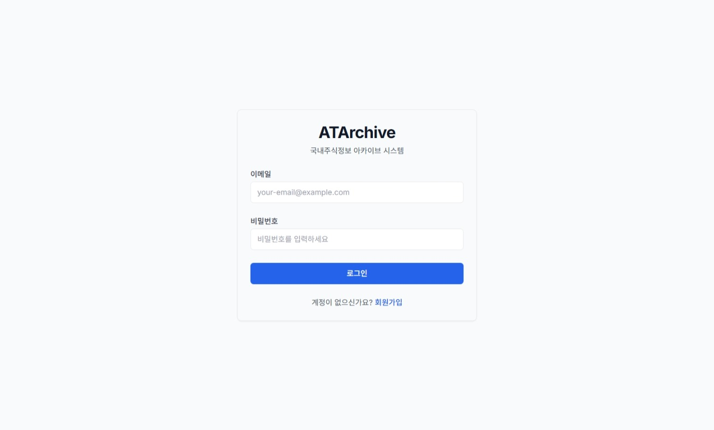
   - 해외주식정보 아카이브 : [atarchive-oversea.duckdns.org](http://atarchive-oversea.duckdns.org)
   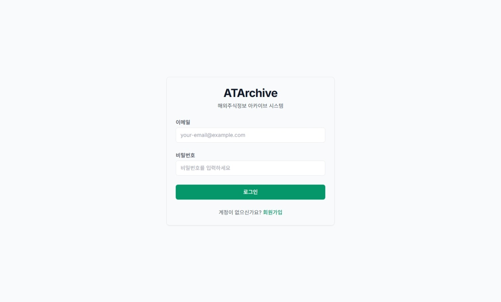
3. 로그인 페이지에서 계정 정보를 입력합니다.
   - 계정이 없는 경우, '회원가입' 버튼을 클릭하여 가입 절차를 진행합니다.
   - 가입 후 관리자의 승인이 필요합니다.

## 2. 기본 사용 방법

### 초기 화면 구성 소개

AT아카이브에 로그인하면 다음과 같은 초기 화면이 표시됩니다:
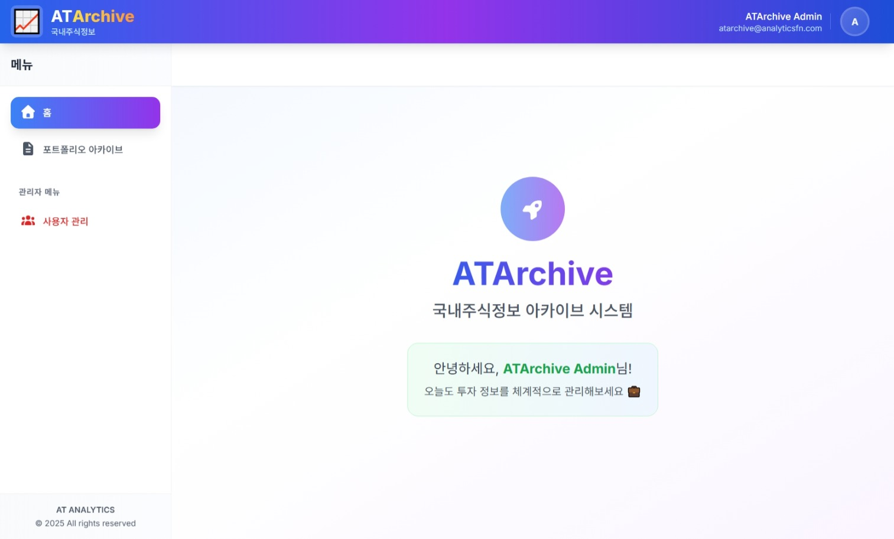
- **헤더**: 상단에 위치하며 로고, 사용자 프로필 정보, 로그아웃 버튼 제공
- **사이드바**: 좌측에 위치하며 메인 메뉴 및 탐색 옵션 제공
- **메인 콘텐츠 영역**: 중앙에 위치하며 현재 선택된 기능의 내용 표시
- **푸터**: 하단에 위치하며 저작권 및 시스템 정보 제공

### 주요 메뉴 및 기능 설명

#### 일반 사용자 메뉴:

- **홈**: 시스템의 메인 페이지로, 환영 메시지와 기본 정보 제공
- **포트폴리오 아카이브**: 주식 포트폴리오 정보를 관리하는 페이지

#### 관리자 메뉴(관리자 권한 필요):

- **사용자 관리**: 시스템 사용자를 관리하고 승인하는 페이지

#### 각 메뉴별 아이콘 및 버튼 설명:

- **홈** 아이콘: 홈 화면으로 이동
- **포트폴리오 아카이브** 아이콘: 포트폴리오 목록 및 관리 페이지로 이동
- **사용자 관리** 아이콘: 사용자 목록 및 관리 페이지로 이동(관리자만 표시)

## 3. 상세 기능 안내

### 회원가입 및 로그인

#### Step 1: 회원가입
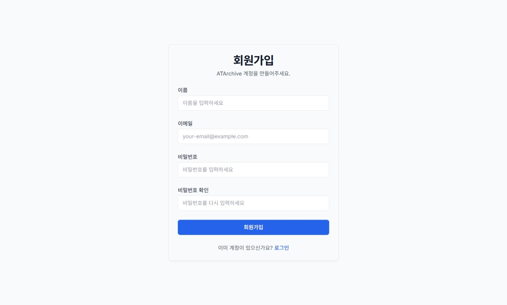
1. 메인 페이지에서 '회원가입' 버튼을 클릭합니다.
2. 이름, 이메일, 비밀번호를 입력합니다.
3. '가입하기' 버튼을 클릭하여 회원가입을 완료합니다.
4. 가입 완료 후, 관리자의 승인을 기다립니다.

#### Step 2: 로그인

1. 메인 페이지에서 '로그인' 버튼을 클릭합니다.
2. 등록한 이메일과 비밀번호를 입력합니다.
3. '로그인' 버튼을 클릭합니다.
4. 승인된 계정인 경우 홈 화면으로 이동합니다.
   - 승인되지 않은 계정은 로그인이 제한됩니다.
   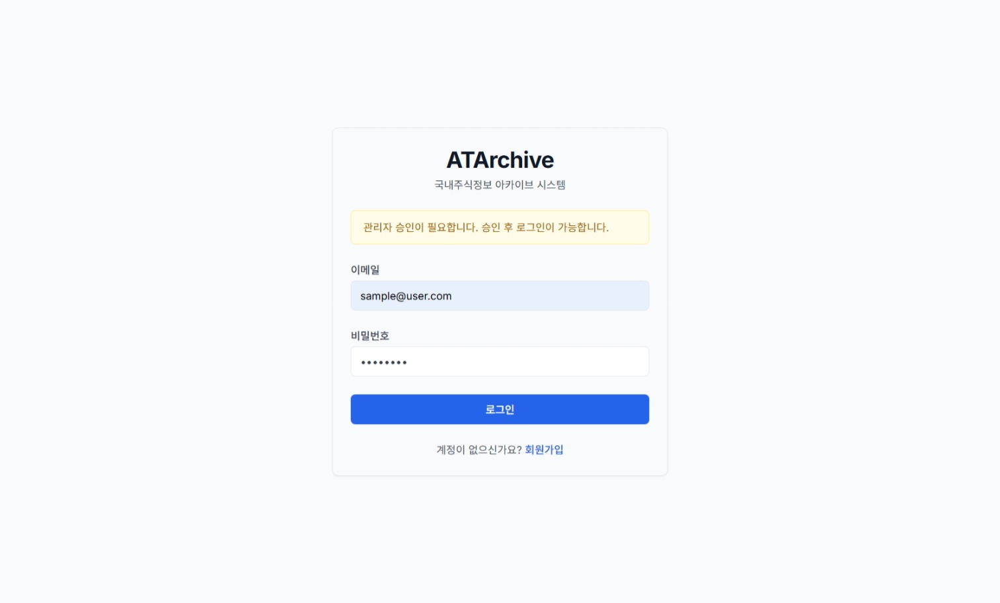

### 포트폴리오 관리

#### Step 1: 포트폴리오 목록 조회

1. 사이드바에서 '포트폴리오 아카이브'를 클릭합니다.
2. 기존 포트폴리오 목록이 표시됩니다.
   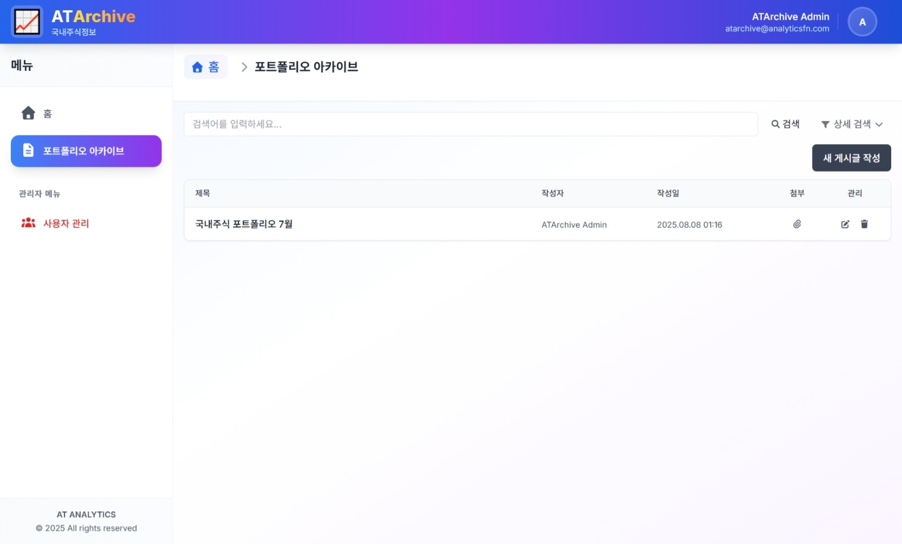
3. 검색 필드를 사용하여 특정 포트폴리오를 검색할 수 있습니다.
   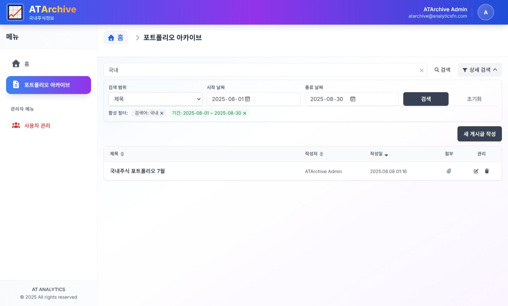
   - 제목, 내용, 작성자 등으로 검색 가능
   - 날짜 범위를 지정하여 필터링 가능
   - 다양한 기준으로 정렬 가능

#### Step 2: 포트폴리오 생성

1. 포트폴리오 목록 페이지에서 '새 게시글 작성' 버튼을 클릭합니다.
2. 제목과 내용을 입력합니다.
   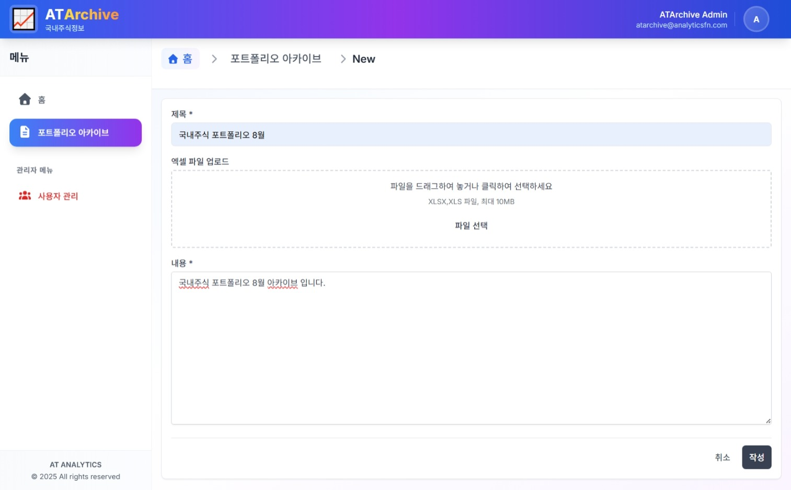
3. 엑셀 파일(.xlsx, .xls)을 업로드합니다.
   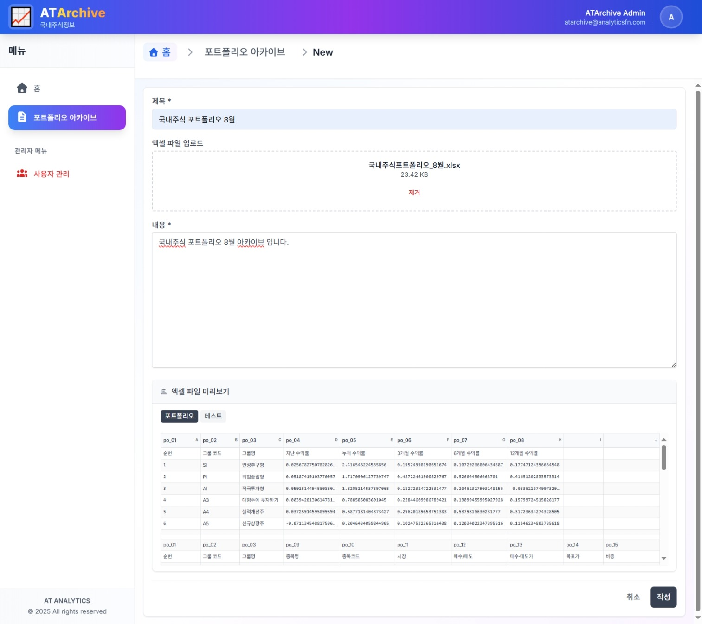
   - 파일 크기는 최대 10MB까지 지원
   - 업로드 후 파일 내용이 미리보기로 표시됨
4. 다중 시트가 있는 경우, 시트 탭을 클릭하여 각 시트 내용 확인 가능
5. '작성' 버튼을 클릭하여 저장합니다.

#### Step 3: 포트폴리오 상세 조회
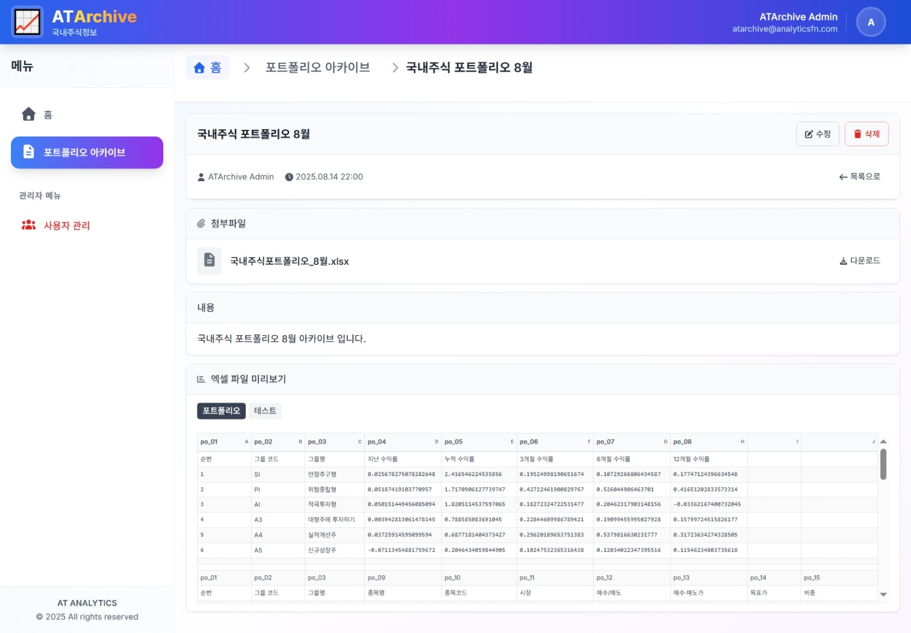
1. 포트폴리오 목록에서 조회하고 싶은 항목을 클릭합니다.   
2. 포트폴리오의 상세 정보(제목, 내용, 작성자, 작성일)가 표시됩니다.
3. 첨부된 엑셀 파일이 있다면 미리보기로 확인 가능합니다.
4. '다운로드' 버튼을 클릭하여 원본 엑셀 파일을 다운로드할 수 있습니다.

#### Step 4: 포트폴리오 수정
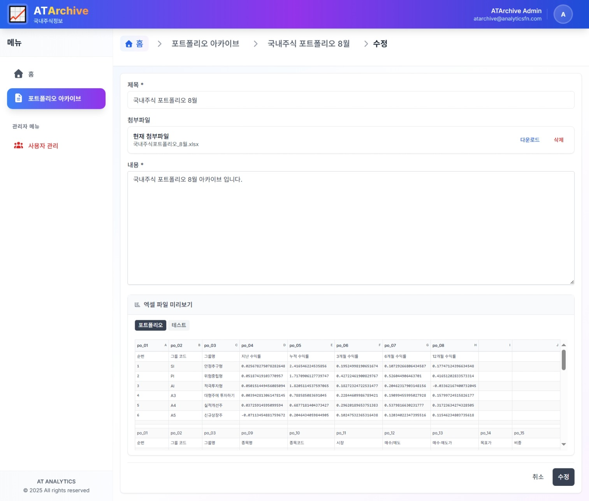
1. 포트폴리오 상세 페이지에서 '수정' 버튼을 클릭합니다.
2. 제목, 내용을 수정합니다.
3. 필요시 새 엑셀 파일을 업로드하거나 기존 파일 삭제 가능
4. '수정' 버튼을 클릭하여 변경사항을 저장합니다.

#### Step 5: 포트폴리오 삭제

1. 포트폴리오 상세 페이지에서 '삭제' 버튼을 클릭합니다.
2. 삭제 확인 메시지가 표시됩니다.
   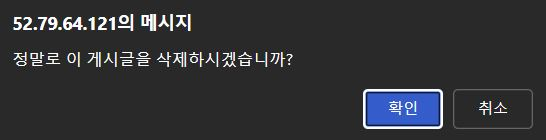
3. '확인'을 클릭하여 포트폴리오를 삭제합니다.

### 사용자 관리 (관리자용)

#### Step 1: 사용자 목록 조회

1. 관리자 계정으로 로그인합니다.
2. 사이드바에서 '사용자 관리'를 클릭합니다.
3. 시스템에 등록된 모든 사용자 목록이 표시됩니다.
   - 이름, 이메일, 역할, 승인 상태, 가입일 정보 확인 가능

#### Step 2: 사용자 필터링 및 검색
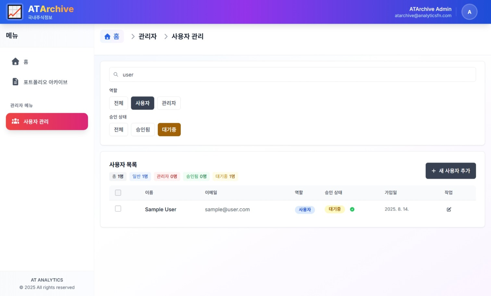
1. 이름 또는 이메일로 검색 필드에 검색어를 입력합니다.
2. 역할 필터(전체, 사용자, 관리자)를 선택합니다.
3. 승인 상태 필터(전체, 승인됨, 대기중)를 선택합니다.
4. 결과가 자동으로 필터링되어 표시됩니다.

#### Step 3: 사용자 승인/해제
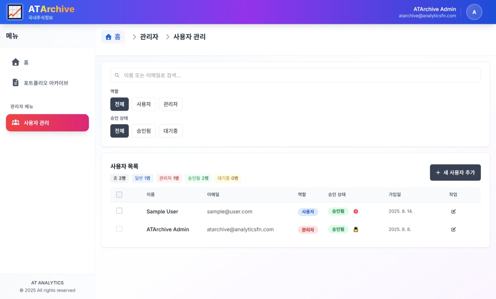
1. 사용자 목록에서 승인/해제할 사용자의 승인 상태 옆 버튼을 클릭합니다.
   - 승인된 사용자는 승인 해제 가능
   - 대기중인 사용자는 승인 가능
2. 확인 메시지가 표시됩니다.
3. '확인'을 클릭하여 승인 상태를 변경합니다.

#### Step 4: 일괄 작업
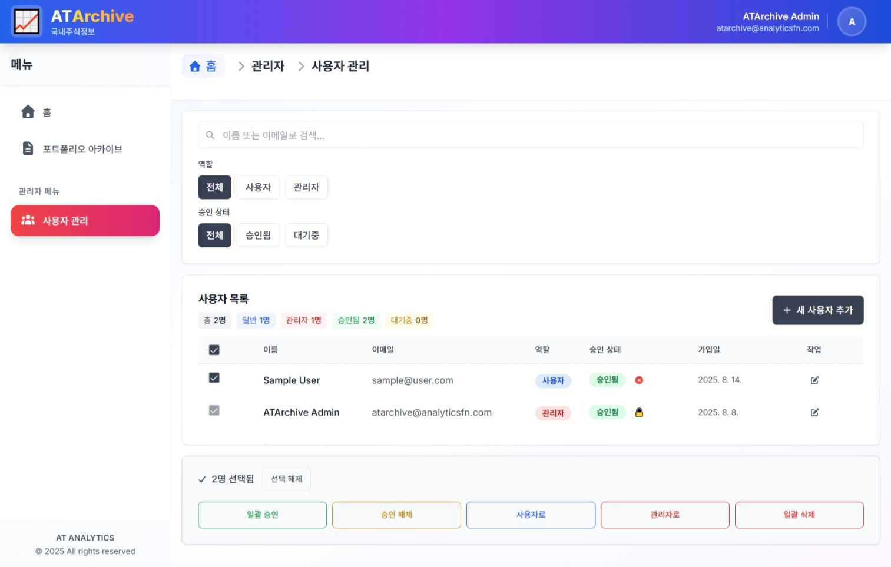
1. 작업을 수행할 사용자들의 체크박스를 선택합니다.
2. 여러 사용자를 한 번에 선택 가능합니다.
3. 화면 하단에 나타나는 일괄 작업 도구에서 원하는 작업 버튼을 클릭합니다:
   - 일괄 승인: 선택한 사용자들을 모두 승인
   - 승인 해제: 선택한 사용자들의 승인 모두 해제
   - 사용자로: 선택한 사용자들의 역할을 일반 사용자로 변경
   - 관리자로: 선택한 사용자들의 역할을 관리자로 변경
   - 일괄 삭제: 선택한 사용자들을 모두 삭제

## 4. 문제 해결 가이드 (Troubleshooting)

### 자주 발생하는 문제와 원인

#### 로그인 관련 문제

- **문제**: 로그인 시 "계정이 승인되지 않았습니다" 메시지 표시

  - **원인**: 가입 후 관리자의 승인이 필요함
  - **해결 방법**: 관리자에게 계정 승인을 요청하세요
- **문제**: 비밀번호를 잊어버렸을 때

  - **원인**: 사용자 인증 정보 분실
  - **해결 방법**: 로그인 페이지의 '비밀번호 찾기' 기능 이용 또는 관리자에게 문의

#### 파일 업로드 관련 문제

- **문제**: "파일 형식이 지원되지 않습니다" 오류 메시지

  - **원인**: 지원되지 않는 파일 형식 업로드 시도
  - **해결 방법**: .xlsx 또는 .xls 형식의 엑셀 파일만 업로드 가능
- **문제**: "파일 크기가 너무 큽니다" 오류 메시지

  - **원인**: 10MB 이상의 파일 업로드 시도
  - **해결 방법**: 파일 크기를 10MB 이하로 줄이거나 분할하여 업로드
- **문제**: 엑셀 파일 미리보기가 표시되지 않음

  - **원인**: 브라우저 호환성 또는 파일 손상 문제
  - **해결 방법**: 다른 브라우저 사용, 파일 형식 확인, 또는 파일 다시 저장 후 재시도

#### 성능 관련 문제

- **문제**: 페이지 로딩 속도가 느림
  - **원인**: 네트워크 연결 불안정 또는 대용량 데이터 로딩
  - **해결 방법**: 인터넷 연결 확인, 브라우저 캐시 정리, 또는 검색 필터를 좁혀 데이터량 줄이기

### 해결 방법 단계별 안내

#### 브라우저 캐시 정리

1. 브라우저 설정 메뉴를 엽니다.
2. '개인정보 및 보안' 또는 유사한 메뉴를 찾습니다.
3. '인터넷 사용 기록 삭제' 또는 '캐시 비우기' 옵션을 선택합니다.
4. 필요한 항목을 선택하고 확인합니다.
5. 브라우저를 재시작합니다.

#### 브라우저 호환성 문제

1. 크롬, 파이어폭스, 엣지 등 다른 모던 브라우저로 전환합니다.
2. 브라우저를 최신 버전으로 업데이트합니다.
3. 브라우저 확장 프로그램을 비활성화합니다.
4. 시크릿 모드 또는 개인정보 보호 모드로 접속해 봅니다.

## 5. FAQ

### Q: 회원가입 후 바로 로그인할 수 있나요?

A: 아니요, 관리자의 승인이 필요합니다. 회원가입 완료 후 관리자가 계정을 승인하면 로그인이 가능합니다.

### Q: 어떤 파일 형식을 업로드할 수 있나요?

A: 현재 .xlsx 및 .xls 형식의 엑셀 파일만 지원됩니다. 최대 파일 크기는 10MB입니다.

### Q: 다중 시트를 포함한 엑셀 파일도 지원하나요?

A: 네, 다중 시트를 포함한 엑셀 파일도 지원합니다. 업로드 후 시트 탭을 클릭하여 각 시트 내용을 확인할 수 있습니다.

### Q: 계정 권한은 어떻게 구분되나요?

A: 계정 권한은 'USER'와 'ADMIN' 두 가지로 구분됩니다. 일반 사용자(USER)는 포트폴리오 조회 및 관리 기능을 이용할 수 있으며, 관리자(ADMIN)는 추가로 사용자 관리 기능을 사용할 수 있습니다.

### Q: 삭제된 포트폴리오를 복구할 수 있나요?

A: 아니요, 삭제된 포트폴리오는 복구할 수 없습니다. 삭제 전에 중요한 데이터는 백업해 두시기 바랍니다.

### Q: 시스템에 저장된 데이터는 안전한가요?

A: 네, 시스템은 데이터 보안을 위해 다양한 보안 조치를 적용하고 있습니다. 사용자 비밀번호는 암호화되어 저장되며, 인증 및 인가 시스템을 통해 데이터 접근을 제한합니다.

### Q: 모바일 기기에서도 사용할 수 있나요?

A: 네, 반응형 디자인이 적용되어 데스크톱, 태블릿, 모바일 등 다양한 기기에서 사용 가능합니다.

---

**작성자**: ATArchive 개발팀
**작성일**: 2025년 8월
**문서 버전**: 1.0
